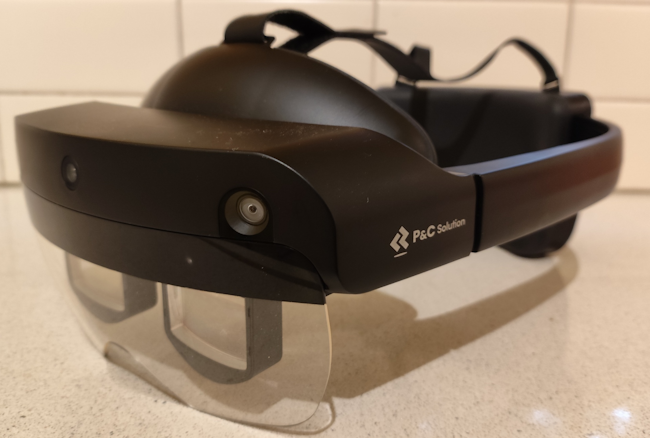
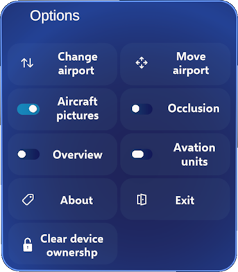
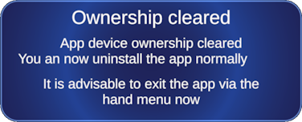

The [MetaLense 2](https://www.pncsolution.co.kr/eng/metalense/) is a Mixed Reality device that is hardly known outside Asia. It remarkably looks like the HoloLens 2, yet is running an Android based operating system. To prevent any confusion: it has *no relation whatsoever* to the *company* Meta, the company run by Mark Zuckerberg. The device is made by [P&C Solution](https://www.pncsolution.co.kr/eng), a South Korean company based in Seoul. 



You can download HoloATC for P&C MetaLense 2 [directly via this link](https://www.schaikweb.net/HoloATC/MTL2/HoloATC_MetaLense2_1.1.5.0.apk?v=1.1.5.0)

You can install it by connecting the MetaLense 2 to your PC, then install it by using the following command

```dos
adb install HoloATC_MetaLense2_1.1.5.0.apk
```

To be able to run adb commands, you will need to download the [Android SDK Platform Tools](https://developer.android.com/tools/releases/platform-tools) 

Since P&C Solution does not offer a store, this app looks for update on my site and notifies you of this. If you want the app to actually download and install the update itself, you can make it 'device owner'

```dos
adb shell dpm set-device-owner com.metalense.LocalJoost.HoloATC/com.localjoost.services.AdminReceiver
```

There is an important caveat there can only be one app device owner, and after running this command you cannot unmake it device owner, nor uninstall it using the MetaLense 2 or an adb command. When the app is device owner, you will get an extra button "Clear device ownership" in the hand menu.

  

After you have pressed that button, the app will report it has cleared the ownership:



Now you can proceed to uninstall the app via the menu or via adb:

```dos
adb shell pm uninstall com.metalense.LocalJoost.HoloATC
```


